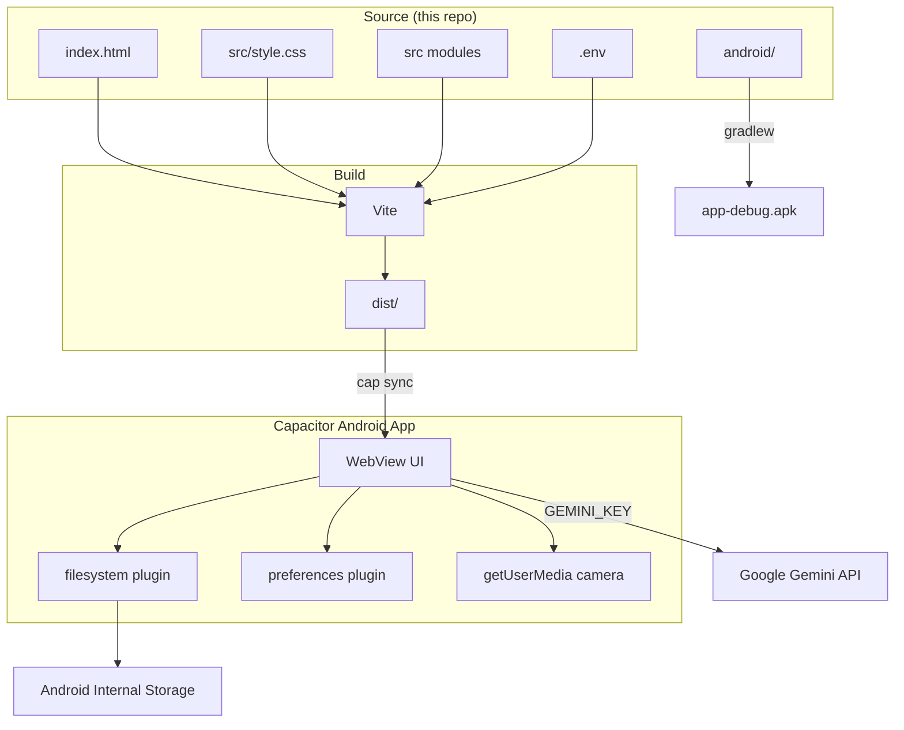
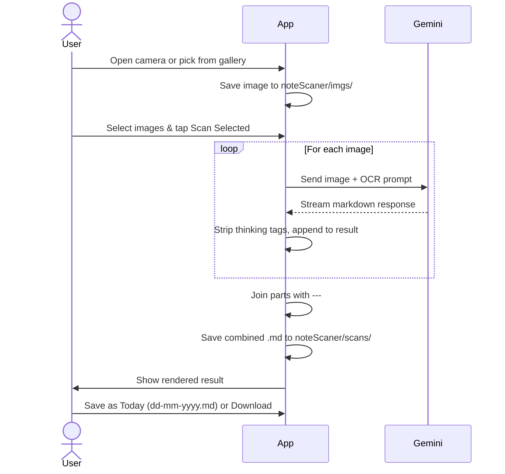
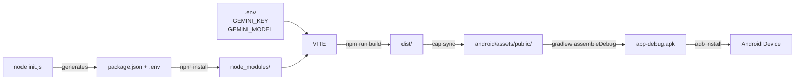

# NoteScaner — Android + Web

NoteScaner turns handwritten notes into clean Markdown using Google Gemini AI. Take a photo or pick images from the gallery, tap Scan, and get structured Markdown — headings, lists, tables, and Mermaid diagrams — saved instantly.

Available as a native Android app (Capacitor) and a local web app (Vite dev server).

---

## Screenshots

| Main | Notes | Settings |
|:---:|:---:|:---:|
|  |  |  |

---

## Tech Stack

| Layer | Technology |
|---|---|
| UI | Vanilla JS + CSS (no framework) |
| Bundler | Vite 8 |
| Markdown render | marked 18 |
| Diagram render | Mermaid 11 |
| AI / OCR | Google Gemini API (`@google/generative-ai`) |
| Native bridge | Capacitor 8 |
| Camera | Browser `getUserMedia` (in-app, no redirect) |
| File storage | `@capacitor/filesystem` → Android internal storage |
| Preferences | `@capacitor/preferences` → SharedPreferences |
| Android build | Gradle + `adb` |

---

## Architecture



---

## Scan Flow



---

## Build Pipeline



---

## Requirements

- Node.js 18+
- Java 21 (`/opt/homebrew/opt/openjdk@21`)
- Android SDK (`~/Library/Android/sdk`)
- A [Gemini API key](https://aistudio.google.com/app/apikey)
- Android device with USB debugging enabled (for device install)

---

## Setup

### 1. Run the init script

```bash
node init.js
```

This generates `package.json`, installs dependencies, and walks you through creating `.env`.

### 2. Or manually configure `.env`

```env
GEMINI_KEY=your_api_key_here
GEMINI_MODEL=gemini-2.0-flash
PORT=3004
```

`GEMINI_MODEL` is baked into the app at build time and used as the default model in Settings.

---

## Running on Web

```bash
npm run dev
```

Opens at:
- Local: `http://localhost:3004`
- Network: `http://192.168.x.x:3004` — accessible from any device on the same Wi-Fi

---

## Building & Installing on Android

### Build + install to connected device

```bash
npm run run
```

### Build APK only (saved to `apk/NoteScaner.apk`)

```bash
npm run apk
```

### Sync web assets without full rebuild

```bash
npm run sync
```

### Open in Android Studio

```bash
npm run open
```

---

## Viewing device logs

```bash
npm run log
```

Shows only your app's logs, filtering out system noise.

---

## Features

- **In-app camera** — live viewfinder directly in the WebView via `getUserMedia`, no redirect to the camera app
- **Upload** — drag-and-drop or file picker; default tab on open
- **Multi-select batch scan** — select multiple images, scan in sequence, one combined `.md` output
- **Gemini streaming OCR** — response streams live; model thinking stripped automatically
- **Save as Today** — one-tap save to `dd-mm-yyyy.md`
- **Note rename** — inline rename with a quick-fill button for today's date
- **Mermaid diagrams** — graphs and flowcharts render as interactive diagrams
- **Image gallery** — paginated 3-column grid, 9 per page; native URIs (memory-efficient)
- **Saved Notes** — browse, open, rename, and delete all past scan results
- **Edge-to-edge UI** — respects system status bar and gesture navigation bar safe areas
- **Copy MD / Download .md** — export scan results

---

## File Structure

```
noteScaner-android/
├── src/
│   ├── main.js         # Entry point — init, mermaid/marked setup
│   ├── style.css       # All CSS
│   ├── constants.js    # Shared constants and OCR prompt
│   ├── ui.js           # Navigation, toast, status, overlay
│   ├── api.js          # Gemini API calls, stripThinking
│   ├── filesystem.js   # File read/write helpers
│   ├── camera.js       # In-app camera + upload
│   ├── gallery.js      # Image gallery + multi-select
│   ├── scan.js         # Single and batch scan logic
│   ├── result.js       # Result display + export
│   ├── notes.js        # Notes list, rename, delete
│   └── settings.js     # API key, model settings
├── index.html            # HTML shell
├── public/
│   └── appImg.jpeg       # Header logo
├── android/              # Capacitor Android project (native customisations)
├── assests/              # Source design assets
├── init.js               # First-time setup script
├── capacitor.config.json
├── vite.config.js
└── .env                  # API keys and config (not committed)
```

---

## What's committed vs generated

| Path | Committed | Reason |
|---|---|---|
| `src/`, `index.html`, `public/` | ✅ | Source code |
| `android/` | ✅ | Native customisations (MainActivity, icons, styles) |
| `init.js`, `vite.config.js`, `capacitor.config.json` | ✅ | Config |
| `.env` | ❌ | Contains secrets |
| `package.json`, `package-lock.json` | ❌ | Generated by `init.js` |
| `node_modules/`, `dist/`, `apk/` | ❌ | Generated at build time |
| `android/.gradle/`, `android/app/build/` | ❌ | Gradle build cache |
| `android/app/src/main/assets/public/` | ❌ | Synced by `cap sync` |

---

## Troubleshooting

**Camera not working**
The app uses `getUserMedia` for in-app camera. On first use the browser will prompt for camera permission — tap Allow. If denied, go to Android Settings → Apps → NoteScaner → Permissions.

**Plugins not implemented error**
Run `npm install` then `npm run run` to ensure native plugins are synced into the Android project.

**`adb: no devices found`**
Enable USB debugging (Settings → Developer Options → USB Debugging) and accept the trust prompt on the device.

**Java not found during build**
The npm scripts export `JAVA_HOME` and `PATH` automatically. If running Gradle directly:
```bash
export JAVA_HOME=/opt/homebrew/opt/openjdk@21
export PATH="$JAVA_HOME/bin:$PATH"
```

**Port 3004 already in use**
```bash
lsof -ti :3004 | xargs kill
```
